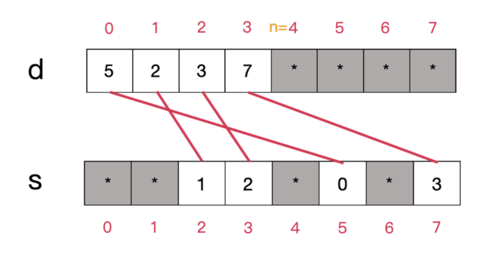

+++
title = '[Tutorial] The sparse set data structure'
date = 2024-03-24T17:09:01+08:00
draft = false
tags = ['Codeforces', 'DSA']

+++

[[Tutorial] The sparse set data structure - Codeforces](https://codeforces.com/blog/entry/127472)

Original post: [https://codeforces.com/blog/entry/127472](https://codeforces.com/blog/entry/127472)

Hello, Codeforces!

I recently came across a data structure that I find quite interesting: the **sparse set**. It functions similarly to a bitset and supports all its operations but has some quirks and useful features of its own. Particularly, unlike almost every other data structure, it does not need to be *initialised* at all before it can be used! Naturally, that also means that its data can be reset in $\mathcal O(1)$ time, as opposed to the $\mathcal O(n)$ time expected of regular bitsets. It also has the added benefit that traversing its elements takes time proportional to the number of elements rather than the size of the data structure, making the operation more efficient for sparse bitsets. However, note that it is likely less efficient in terms of its memory usage (still $\mathcal O(n)$ but ~64× larger constant) and constant time factor.

# Introduction

The sparse set consists simply of two integer arrays (which I'll call $d$ and $s$) and a size variable $n$, satisfying the following class invariants:

- **Invariant 1**: $d[0..(n−1)]$ (inclusive) stores the elements of the bitset;
- **Invariant 2**: If $e$ is an element of the bitset, then $s[e]$ stores its index in the 𝑑 array.

In most literature covering this data structure, the arrays $d$ and $s$ are called the 'dense' and the 'sparse' arrays, respectively.

For any array element not mentioned above, its value can be *anything* without affecting the function of the data structure.

A typical sparse set might look like this (asterisk denotes terms that can be anything):



The red lines indicate the connections between the elements in $d$ and $s$. It can be shown that, for all indices $i$ in the range $[0,n−1]$, the constraint $d[s[d[i]]]=d[i]$ is satisfied.

In C++ code, the data structure can be represented as follows:

```cpp
template <int N>
struct sparse_set {
	int n;
	int d[N], s[N];
};
```

Note that, in this article, we would use $N$ to denote the size of the data structure itself (and thus, the set of elements allowed is $0,1,\ldots,N−1$), and $n$ to denote the number of elements currently stored.

**Important implementation detail**: if you are using C, C++, or Rust, you still *have* to initialise this data structure in its constructor since accessing an uninitialised element does not return an unspecified value; it is undefined behaviour and can introduce bugs elsewhere in your program. You don't have to do this when resetting the data structure, however.

- **Example one-line constructor**
    
    sparse_set(): n{0}, d{}, s{} {}
    

# Lookup

- **Precondition**: 𝑖𝑑𝑥 is a value between 0 and 𝑁−1;
- **Postcondition**: the data structure is unmodified, and 𝑖𝑑𝑥's presence in the bitset is returned.
- **Time cost**: 𝑂(1)

Surely, since 𝑠[𝑖] stores the position of element 𝑖 in 𝑑, I can simply check if 𝑠[𝑖] is between 0 and 𝑛−1 to determine whether 𝑖 is in the bitset, right?

```cpp
// Intentionally incorrect code!
template <int N>
bool sparse_set<N>::test(int idx) const {
	return s[idx] >= 0 && s[idx] < n;
}
```

Not really… it is entirely possible that 𝑖 is not in the set, yet 𝑠[𝑖] has a 'valid' value between 0 and 𝑛−1 since the data structure specifies no guarantees for values of 𝑠[𝑖] where 𝑖 is not an element; therefore false positives might arise. We have to check if the value of 𝑑[𝑠[𝑖]] links *back* to the correct value of 𝑖.


Here, 6 isn't actually stored in the data structure, but 𝑠[6] happened to be a 'correct' index, misleading our erroneous algorithm to think that it is.

The correct implementation of the lookup operation would look something like this:

```cpp
template <int N>
bool sparse_set<N>::test(int idx) const {
    return s[idx] >= 0 && s[idx] < n && d[s[idx]] == idx;
}
```

# Insertion

- **Precondition**: 𝑖𝑑𝑥 is an integer between 0 and 𝑁−1.
- **Postcondition**: 𝑖𝑑𝑥 is inserted into the data structure if and only if it wasn't already present.
- **Time cost**: 𝑂(1)

Just like normal bitsets, our implementation does not allow duplicate elements. Therefore, we have to check whether the element is present before inserting. Inserting an element is a rather simple operation: if the element is not already present, we push its value onto the 𝑑 array, update 𝑠[𝑖𝑑𝑥] to the correct value, and then increment the value of 𝑛 by 1.


The code to do this would look a bit like this:

```cpp
template <int N>
void sparse_set<N>::set(int idx) {
    if (test(idx)) { return; }
    d[n] = idx;
    s[idx] = n;
    n++;
}
```

# Deletion

- **Precondition**: 𝑖𝑑𝑥 is an index between 0 and 𝑁−1.
- **Postcondition**: if 𝑖𝑑𝑥 was inside the set, it is now removed.
- **Time cost**: 𝑂(1).

As the inverse operation of insertion, deletion is slightly more complex to implement than insertion but is nevertheless still rather straightforward. The central idea is to swap the last element with the element to be deleted in the 𝑑 array, then update the corresponding values in 𝑠 accordingly.

Basic procedure:

- We want to make 𝑖𝑑𝑥 the new position for our last element, therefore change 𝑠[𝑑[𝑛−1]] to 𝑠[𝑖𝑑𝑥].
- Overwrite 𝑑[𝑠[𝑖𝑑𝑥]] with the value of 𝑑[𝑛−1].
- Decrement 𝑛 by 1.
- No need to modify 𝑠[𝑖𝑑𝑥] since the class invariant doesn't care about 𝑠[𝑒] for deleted elements 𝑒.

The diagram for doing the above operations would look a bit like this:


Note that the above procedure still works when the element being deleted is the last element in the 𝑑 array, albeit with extra steps. However, since deletions to the last element are rare, it is not worth adding a branch to check for this condition.

Therefore, the code for this operation would look as follows:

```cpp
template <int N>
void sparse_set<N>::reset(int idx) {
	if (!test(idx)) {return; }
  d[s[idx]] = d[n-1];
  s[d[n-1]] = s[idx];
  n--;
}
```

# Clearance

- **Precondition**: None
- **Postcondition**: the bitset is cleared. Before modifications, `.get(i)` returns false for all valid 𝑖.
- **Time cost**: 𝑂(1)

Out of all the operations that the sparse set supports, this is arguably the most powerful, taking only 𝑂(1) time to compute, with an extremely simple implementation.


This is literally everything that has to be done :)

```cpp
template <int N>
void sparse_set<N>::reset() {
    n = 0;
}
```

# Iteration

- **Precondition**: None
- **Postcondition**: Iterates through the elements of the bitset.
- **Time cost**: 𝑂(𝑛) (note: 𝑛 is the number of elements present. This is different from 𝑂(𝑁) where 𝑁 is the size of the container)

This is another operation where the sparse set is better than the classic bitset. Rather than iterating bit-by-bit and checking whether each element is present, we can simply iterate through 𝑑[0..(𝑛−1)] (inclusive) to obtain the list of elements present in the bitset.

As an added bonus, if no deletion operation has been conducted since the last initialisation/clearance, the elements in 𝑑[0..(𝑛−1)] will be in the order that they are added, with the least recently added item in 𝑑[0] and the most recent in 𝑑[𝑛−1], just like a vector.

# Full Implementation

The following is a C++ template implementation of the sparse set that I have written. It tries to implement all functionalities of a vanilla C++ bitset.

Some implementation details:

- The type of data this implementation of the sparse set stores is `std::size_t`, just like the STL bitset.
- Like the STL bitset, using `[]` to access and modify elements is supported. The semantics are the same as a STL bitset.
- `test`, `set`, `reset`, and `flip` all throw `std::out_of_range` if the parameter is greater than or equal to 𝑁. However, using `[]` to access elements with out-of-range indices results in undefined behaviour.
- Iterators are supported and iterate through all elements in the set. The values they point to are immutable.
    - This also means you can use a range-for loop to access all elements of a sparse set.
- **Full code**
    
```cpp
#include <array>
#include <algorithm>
#include <cstddef>
#include <exception>
#include <limits>

template <std::size_t N>
class sparse_set {
    using size_type = std::size_t;

public:
    sparse_set(): n_{0}, d_{}, s_{} {}

    sparse_set(unsigned long long bits): sparse_set() {
        for (size_type i = 0; i < std::min<size_type>(N, std::numeric_limits<unsigned long long>::digits); i++) {
            if ((bits >> i) & 1) {
                set(i);
            }
        }
    }

    bool operator==(const sparse_set<N>& other) const {
        for (size_type i = 0; i < N; i++) {
            if ((*this)[i] != other[i]) { return false; }
        }
        return true;
    }

    struct reference {
        sparse_set* s;
        size_type pos;

        reference& operator=(bool b) {
            if (b) {
                s->set(pos);
            } else {
                s->reset(pos);
            }

            return *this;
        }

        void flip() {
            s->flip(pos);
        }

        operator bool() const {
            return (*(const sparse_set*) s)[pos];
        }
    };

    struct iterator {
        sparse_set* s;
        size_type idx;

        bool operator==(iterator other) const {
            if (!s) { return !other.s; }
            else { return s == other.s && idx == other.idx; }
        }

        iterator& operator++() {
            idx++;
            if (idx >= s->n_) {
                s = nullptr;
            }
            return *this;
        }

        iterator operator++(int) {
            auto prev = *this;
            ++(*this);
            return prev;
        }

        size_type operator*() const {
            return s->d_[idx];
        }
    };

    bool operator[](size_type i) const {
        return s_[i] >= 0 && s_[i] < n_ && d_[s_[i]] == i;
    }

    reference operator[](size_type i) {
        return reference{this, i};
    }

    bool test(size_type i) const {
        if (i >= N) { throw std::out_of_range{"test(): argument out of range"}; }
        return (*this)[i];
    }

    bool all() const { return n_ == N; }
    bool any() const { return n_ != 0; }
    bool none() const { return n_ == 0; }
    size_type count() const { return n_; }

    size_type size() const { return N; }

    void set() {
        for (size_type i = 0; i < N; i++) {
            set(i);
        }
    }

    void set(size_type i) {
        if (test(i)) { return; }
        d_[n_] = i;
        s_[i] = n_;
        n_++;
    }

    void reset() {
        n_ = 0;
    }

    void reset(size_type i) {
        if (!test(i)) { return; }
        d_[s_[i]] = d_[n_-1];
        s_[d_[n_-1]] = s_[i];
        n_--;
    }

    void flip() {
        for (size_type i = 0; i < N; i++) {
            flip(i);
        }
    }

    void flip(size_type i) {
        if (test(i)) { reset(i); }
        else { set(i); }
    }

    iterator begin() {
        if (n_ == 0) {
            return iterator{nullptr, 0};
        } else {
            return iterator{this, 0};
        }
    }

    const iterator begin() const {
        if (n_ == 0) {
            return iterator{nullptr, 0};
        } else {
            return iterator{this, 0};
        }
    }

    iterator end() {
        return iterator{nullptr, 0};
    }

    const iterator end() const {
        return iterator{nullptr, 0};
    }

private:
    size_type n_;
    std::array<size_type, N> d_;
    std::array<size_type, N> s_;
};
```
    

# Conclusion

While the sparse set data structure is rather obscure and almost never used in competitive programming, I think it can be useful in quite a few scenarios. In particular, it can be used as a more performant and hack-resistant version of `std::set` and `std::unordered_set` when the only type of data that needs to be stored is small integers. I believe that many of its applications already have alternatives in the STL, however.

So, the above is just a little data structure that I would like to share with you all. If you have any feedback regarding the content or the format (by the way, I really need a better method of creating these diagrams), please kindly leave it in the comments below. Thank you so much for reading all the way here!

# References

- **List of references**
    
    Most of this article's content is taken from [this website](https://research.swtch.com/sparse), which provides some interesting history and a great summary of this structure, forming the basis of this article.
    
    Other sources referenced:
    
    - [https://skypjack.github.io/2020-08-02-ecs-baf-part-9/](https://skypjack.github.io/2020-08-02-ecs-baf-part-9/)
    - [https://manenko.com/2021/05/23/sparse-sets.html](https://manenko.com/2021/05/23/sparse-sets.html)